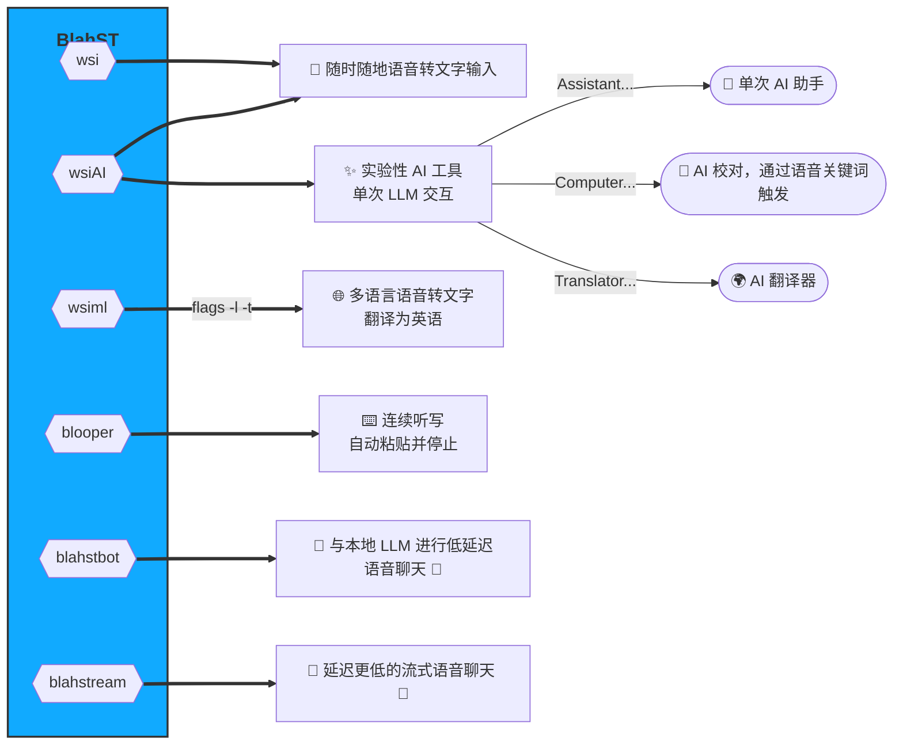

#  BlahST - 在任何可编辑文本框中进行语音输入 </img>

**Blah** **S**peech-to-**T**ext（Blah 语音转文字）让您在 Linux 上通过键盘快捷键和 whisper.cpp 享受极速的语音输入体验。启动您的麦克风，即可离线进行高质量、多语言的语音识别。通过本地大语言模型（LLM）的扩展，它成为了一个与 Linux 计算机对话的强大工具。没有消耗显存（VRAM）的图形界面，只有几个可配置的 [热键](./resources/hotkeys.png)。

**BlahST 可能是 Linux 上基于 Whisper 的最精简的语音转文字输入工具，它直接构建在 whisper.cpp 之上。**

- **通过本地 whisper.cpp 或 whisper.cpp 服务器实现快速语音识别，网络转录速度更上一层楼。[网络转录说明](./API_TRANSCRIBE.md)**
- **可以使用专用的 `wsiml` 脚本选择语音输入语言并翻译为英语。**
- **支持选择使用下载的便携式 [whisperfile](https://huggingface.co/Mozilla/whisperfile/tree/main)（可通过 `wsi -w` 热键设置）。**
- **`blooper` 实用工具可实现连续的“免提”语音输入或听写，并利用 xdotool 或 ydotool 自动粘贴循环。在长时间沉默时会自动退出，并可通过热键重新激活。**
- **通过 [llama.cpp](https://github.com/ggerganov/llama.cpp) 或 [llamafile](https://github.com/Mozilla-Ocho/llamafile) 与本地 LLM 交互，生成文本回答或翻译，并能自动朗读（语音合成）并将内容存入剪贴板。此功能包含在 `wsiAI` 和 `blahstbot` 脚本中。**
- **实验性功能：添加了 AI 校对器，可通过语音触发对任何选定（可编辑）文本的操作：“Computer, proofread ...（计算机，校对……）”或“Computer be like Grammarly..（计算机，像 Grammarly 一样……）”。稍等片刻，选中的文本将被 LLM 自动替换。**
- **新增：与本地 LLM 进行低延迟语音聊天（`blahstbot`）。与 LLM 进行自然的语音对话，并可选择加载鼠标选中的任何文本作为上下文。请观看下方视频，查看在配备 12GB 显卡的普通 Linux 计算机上的演示（请开启声音）。**
  **([另一个多语言语音聊天演示](./SPEECH-CHAT.md))**
- **更新且处于实验阶段：使用 `blahstream` 进行流式语音对语音聊天，它还会在文本到达时自动将其粘贴到初始目标窗口中。通过摘要技术管理上下文压缩。**

https://github.com/user-attachments/assets/022adffc-3e13-48cd-be5d-5919f1d5cae7

*上方视频演示了使用 `blahstbot` 与加载在本地 llama-server 上的 Gemma3_12B 进行语音交互。几乎没有延迟，LLM 响应非常迅速，对话过程十分流畅。在底层，该脚本（由绑定到 `blahstbot -n` 的 Gnome 热键触发）将识别出的语音文本传递给 llama-server，获取响应，格式化后发送给 piper 进行 TTS（文本转语音）转换，同时将其加载到剪贴板中。请注意，由于 LLM 完全运行在显存中，因此性能非常敏捷。*

使用低资源、经过优化的命令行工具，语音转文本的过程非常快。这是一个包含本地 LLM 功能（AI 助手、翻译器、调度器、CLI 指南测试阶段）的演示视频（请开启声音）：

https://github.com/user-attachments/assets/877c699d-cf8b-4dd2-bc0e-75dee9054cf2

*在上方视频中，音频首先由系统宣布正在录屏（使用了我的 GNOME 扩展 ["Voluble"](https://github.com/QuantiusBenignus/voluble)，它可以朗读所有 GNOME 桌面通知），随后是多轮语音输入/识别。结尾展示了即将推出的“AI 函数”之一：它利用 BlahST (whisper.cpp) 转录的文本，将其格式化为 LLM 提示词，并发送给本地多语言 LLM (llama.cpp 或 llamafile)，后者返回中文翻译文本，并使用神经 TTS 将其读出。通过精简的可执行文件在命令行编排这些操作，使系统保持了惊人的灵活性（从视频中可以看出，PC 运行轻松，温度保持在较低水平）。*

https://github.com/user-attachments/assets/c3842318-14cb-4874-8651-7bc92abd187f

*上方视频（请开启声音）展示了 `blooper` 的用法。它基于 `wsi` 修改而成，可以循环转录，直到用户通过长停顿（预设约为 3 秒）终止语音输入。配合 xdotool（或 Wayland 用户的 ydotool），文本会在每次停顿（或热键中断）时自动粘贴。在视频中，语音由合成语音生成并由麦克风采集。这让我可以同时编辑文本（多任务处理者，请勿在家轻易尝试：）。结尾处，顶栏的麦克风图标应消失，表示程序退出。视频中它未消失是因为录屏工具也占用了该图标。*

---

### 工作原理（*最好的 UI 就是没有 UI。*）

BlahST 的理念是做 UI 软件界的“海啸”：短暂而强大的 CPU/GPU 波动，随后立即消失，只在剪贴板中留下文本痕迹，让桌面回归平静。只需使用一对热键来启动和停止麦克风录音，并将录制的语音发送到 whisper.cpp [[服务器]](./API_TRANSCRIBE.md)，它会将转录的文本转存到剪贴板（除非你在那之前先通过本地 LLM 处理）。这是一种通用方案，适用于大多数 Linux 桌面环境和发行版。

核心脚本包括：
- **wsi**：用于常规语音输入。
- **wsiml**：针对多语言用户。
- **wsiAI**：适用于希望通过 llama.cpp 或 llamafile 与本地大语言模型对话的用户。
- **blooper**：实验性工具，用于在检测到长停顿时自动退出的连续听写。
- **blahstbot**：用于与本地（局域网）LLM 进行语音聊天的工具，执行低延迟的“语音到文本到语音”对话，并将 LLM 的响应供（自动）粘贴使用。
- **blahstream**：流式语音对话工具。



---

语音识别由 whisper.cpp 执行，该程序必须预先在您的 Linux 系统上编译完成，或者作为 [服务器](https://github.com/ggerganov/whisper.cpp/tree/master/examples/server) 实例运行在您的局域网或本地主机（localhost）上。
或者，您可以选择直接下载并使用现成的、可移植的（嵌入了 Whisper 模型的）[whisperfile](https://huggingface.co/Mozilla/whisperfile/tree/main)，它现在是 [llamafile](https://github.com/Mozilla-Ocho/llamafile) 仓库的一部分。

当通过热键启动语音输入时，顶部栏会出现一个麦克风指示图标（至少在 GNOME 中是这样），并会在录音期间持续显示（可以使用另一个热键中断录音）。
麦克风图标从顶部栏消失表示录音完成，此时可以从剪贴板粘贴转录的文本。在性能较弱的系统上，麦克风图标消失后，文本到达剪贴板之前可能会有轻微延迟。在我的电脑上，通过 whisper.cpp 服务器 API，一段平均长度的段落转录时间不到 150 毫秒（使用本地 whisper.cpp 则约为 300 毫秒）。

对于纯键盘操作（例如使用标准的 `CTRL+V`），在 X11 和 Wayland 下将使用标准剪贴板（`wsi` 或 `wsiml`）；而 `wsi -p`（或 `wsiml -p`）则使用 **PRIMARY（首选）** 选择区，通过鼠标中键粘贴。为了方便左手粘贴，语音录制热键可以设置为由右手触发。**例如，我设置了数字键盘上不常用的“+”键（开始录音）和“Insert”键（停止录音）。**

<details>
<summary>数据流图（点击展开）</summary>
   
   #### wsiAI 脚本（LLM 交互示例）
   

   #### blooper（循环语音输入）

</details>

#### 使用总结
* 按下热键组合后，`wsi -p` 脚本将录制语音（通过热键停止或静音检测停止），使用本地 whisper.cpp 进行转录，并将文本发送到 X11 或 Wayland 的 **PRIMARY** 选择区。
然后，您只需在任何地方点击鼠标中键即可粘贴。（对于习惯用右手持鼠标的用户，将语音录制热键设在左手位置会非常方便。）

* 如果使用不带参数的 `wsi`（这两种方式可以共存，只需设置不同的热键），转录的文本将发送到**剪贴板**（而非 PRIMARY 选择区）。
然后按照惯例使用 `CTRL+V`（GNOME 终端为 `CTRL+SHIFT+V`）或 `SHIFT+INSERT` 键粘贴。（对于大多数人，右手热键会很顺手。）

* 如果使用 `wsi -n` 进行网络转录（通过专用热键触发），脚本将尝试将录制的音频发送到运行中且配置正确的 whisper.cpp 服务器（局域网或本地主机）。
随后它会收集文本响应并格式化，以便通过 `CTRL+V` 键粘贴（若要使用鼠标中键粘贴，请改用 `wsi -n -p`）。

* 如果您想使用 whisperfile 而非编译后的 whisper.cpp（或同时使用），请使用 `wsi -w ...` 调用。脚本将使用预设的可移植可执行文件及其内置的 whisper 模型。

* 对于多语言用户，除了 `wsi` 的功能外，`wsiml` 还提供了指定语言的功能（例如 `-l fr` 指定法语），并支持使用 `-t` 标志翻译为英语。用户原则上可以为不同语言设置多个热键。例如，可以设置两个热键，一个用于转录法语（命令为 `wsiml -l fr`），另一个用于将法语翻译为英语（命令为 `wsiml -l fr -t`）。

* **blooper：** 用户可以使用提供的 **blooper** 脚本进行连续、自动的语音转文字输入（无需手动按 CTRL+V 或点击鼠标中键）。这在上面的第二个视频中有所演示。请注意，默认使用剪贴板，文本将自动粘贴在光标处；原则上也可以设置使用 PRIMARY 选择区，这样会模拟鼠标中键点击，在文本可用时将文本粘贴到鼠标指针当前位置。请注意，这依赖于静音检测，而静音检测效果取决于您的物理环境。在嘈杂环境中，请使用热键停止录制。

* **blahstbot：** 当您只想与本地 LLM 进行语音对话时，可以使用 **blahstbot** 进行极低延迟的、无 UI 的语音聊天。这可以通过局域网在性能较低的电脑上实现（使用 `blahstbot -n` 绑定热键，依赖 whisper 服务器和 llama-server）。它不需要持续不断的对话，用户可以在提问之间执行其他任务，使用提供的答案（已存入剪贴板），稍后再回来继续对话或通过语音命令 **"RESET CONTEXT"（重置上下文）** 更改话题。

* **blahstream：** 这是一个虽然仍在开发中（WIP）但已具备实用性的工具。它的功能与 `blahstbot` 类似，但采用流式处理：在 LLM 生成文本的同时，实时进行语音播报和自动粘贴。`blahstream` 通过间歇性摘要管理对话上下文。在 X11 环境下，如果用户离开了目标窗口（自动粘贴的位置），文本将被缓冲，直到用户重新聚焦目标窗口后才会粘贴，而此时 LLM 的流式生成仍在继续。

---

### 系统安装 (SYSTEM SETUP)

#### 前提条件：
- 已在运行现代桌面环境的 Linux 系统上安装 **zsh** 命令行终端。
- 拥有可运行的 [whisper.cpp 安装](https://github.com/ggerganov/whisper.cpp)，或局域网/本地主机上有正在监听的 whisper.cpp 服务器（参见 [网络转录部分](./API_TRANSCRIBE.md)），或者下载好 [whisperfile](https://huggingface.co/Mozilla/whisperfile/tree/main)。
- 将本仓库中的编排工具 **wsi**、**wsiAI** 或 **wsiml**（以及 **blooper**、**blahstbot** 和 **blahstream**）放置在您的 **$HOME/.local/bin/** 文件夹中（确保该路径在您的 **$PATH** 中）。安装脚本 `install-wsi` 会处理大部分操作，但需要先赋予其可执行权限。
- 从系统软件仓库安装最新版本的 `sox`、`xsel`（Wayland 下为 `wl-copy`）命令行工具。
- 一个可以工作的麦克风。
- 若要使用语音聊天功能 (`blahstbot`)，还需要本地 `llama.cpp` 安装或正在监听的 `llama-server`。

> *免责声明：作者不对因与本文档内容交互而可能产生的任何结果承担任何责任。建议的动作和自动化操作（如安装位置等）仅为建议，基于作者的个人选择和观点。由于它们可能不符合每个人的口味或特定情况，请根据需要进行调整。*

#### 安装步骤
在您选择的文件夹中克隆 BlahST 仓库，然后选择以下安装方法之一：

```bash
git clone https://github.com/QuantiusBenignus/BlahST.git
cd ./BlahST
chmod +x install-wsi

# 如果使用安装脚本：
./install-wsi
```

##### 使用安装脚本
- 从克隆的仓库文件夹运行 `install-wsi` 脚本并按照提示操作。它会移动脚本、设置可执行权限、创建 `whisper-cli` 执行文件的链接、设置环境、设置默认的 whisper.cpp 模型、检查依赖项等。如果您选择该选项，脚本还会帮助您设置 whisperfile。
- 安装脚本也处理网络转录的设置，但 whisper.cpp 服务器的 IP 和端口必须手动在 **blahst.cfg** 中设置。
- **所有工具的用户配置已整合到单个文件 `blahst.cfg` 中。您需要编辑该文件中的“USER CONFIGURATION BLOCK”来设置环境。** 各个脚本中也可以设置局部变量覆盖。
- 先直接从命令行运行脚本（如 `wsi` 或 `wsiAI`）以验证运行是否正常。之后再通过 [热键](https://github.com/QuantiusBenignus/BlahST/#gui-setup-of-hotkeys) 调用以提高速度和便利性。

##### 手动安装
*(假设 whisper.cpp 已安装，且已在克隆的仓库中编译了 `whisper-cli` 和/或 `whisper-server`。请参见前提条件部分)*

* 将脚本 **wsi**、**wsiAI**、**wsiml**、**blooper**、**blahstbot**、**blahstream** 和 **blahst.cfg** 放置在 `$HOME/.local/bin/`。
* 赋予它们执行权限：
  ```bash
  cp wsi wsiAI wsiml blooper blahstbot blahstream blahst.cfg $HOME/.local/bin/
  cd $HOME/.local/bin; chmod +x wsi wsiAI wsiml blooper blahstbot blahstream
  ```
* 确保 `$HOME/.local/bin` 已加入您的 `$PATH`（运行 `echo $PATH` 查看）。如果没有，请添加它（例如在 `.profile` 或 `.zprofile` 文件中加入 `export PATH="$HOME/.local/bin:$PATH"`）。
* 编辑 **blahst.cfg** 以及每个文件中的 `USER_CONFIG_BLOCK` 来配置用户环境。请参阅下文的 **“配置”** 部分。
* 从命令行运行一次工具（例如 `wsi -n`），让脚本检查必需的依赖项：
  ```bash
  # 如果 .local/bin 还没在 PATH 中：
  ./wsi -n
  # 如果已经在 PATH 中：
  wsi -n
  # 也可以运行 --help 查看选项：
  wsi --help
  wsiAI --help
  ```
* 如果使用本地 whisper.cpp，请在 `$HOME/.local/bin/`（或您的 $PATH 路径下）创建一个指向 whisper.cpp 目录中编译好的 `whisper-cli` 可执行文件的软链接（代码预期调用名为 `transcribe` 的命令）：
  ```bash
  ln -s /你的/whisper.cpp/路径/whisper-cli $HOME/.local/bin/transcribe
  # 如果使用 whisper-server：
  ln -s /你的/whisper.cpp/路径/whisper-server $HOME/.local/bin/whserver
  ```
  如果 `transcribe` 不在您的 $PATH 中，要么修改 **wsi** 中对它的调用以包含绝对路径，要么将其位置添加到 $PATH 变量中，否则脚本将运行失败。
* 如果您不想编译 whisper.cpp，或者作为补充，可以下载并设置 whisperfile 的执行权限，例如：
  ```bash
  cd $HOME/.local/bin
  wget https://huggingface.co/Mozilla/whisperfile/resolve/main/whisper-tiny.en.llamafile
  chmod +x whisper-tiny.en.llamafile
  ```

---

#### 详细配置 (CONFIGURATION)

**重要提示：** BlahST 的配置已迁移到单一文件 **blahst.cfg** 中，该文件由所有工具共享。在该文件的开头附近，有一个名为 **"USER CONFIGURATION BLOCK"（用户配置块）** 的部分，所有用户可配置的变量都集中在那里，并按工具进行了分组。（在每个脚本内部，可能还有一个配置块用于在需要时覆盖局部设置。）

大多数设置可以保持默认，但最重要的设置是您想要使用的模型文件（Whisper、LLM、TTS）的位置（或者是 whisper.cpp 或 llama.cpp 服务器的 IP 和端口号）。
如果使用 whisperfile，请将 `WHISPERFILE` 变量设置为之前下载的可执行文件名，例如：`WHISPERFILE=whisper-tiny.en.llamafile`（该文件必须在 $PATH 中）。

---

#### 热键图形界面设置 (GUI SETUP OF HOTKEYS)
用于启动和停止语音输入，适用于手动和自动安装方式。

<details>
<summary> 情况 1：GNOME </summary>

##### 设置开始语音录制的快捷键
* 打开 GNOME 系统设置，找到“键盘 (Keyboard)”。
* 点击“键盘快捷键 (Keyboard shortcuts)”，“查看并自定义快捷键 (View and customize shortcuts)”。
* 在新窗口中，向下滚动到“自定义快捷键 (Custom Shortcuts)”并点击。
* 添加一个新快捷键（例如点击 `+`），输入名称：“开始语音录制 (Start Recording Speech)”。
* 在“命令 (Command)”字段中，输入 `/home/你的用户名/.local/bin/wsi -p`（用于使用鼠标中键粘贴），或者改为 `/home/你的用户名/.local/bin/wsi`（用于使用剪贴板粘贴）。
* (多语言模型用户，请将上述 `wsi` 替换为 `wsiml`；如果使用 whisperfile，请添加 `-w` 标志，即 `/home/你的用户名/.local/bin/wsi -w` )。最后，若要体验 LLM 功能，请将 `wsi` 替换为 `wsiAI`。
* 点击“设置快捷键 (Set Shortcut)”并选择一个（未使用的）组合键。例如 **CTRL+ALT+a** 或单个不常用的键如数字键盘上的 **KP+**。
* 点击“添加 (Add)”即可完成。

编排脚本在调用 sox (rec) 时内置了静音检测滤镜，（在理想情况下）会在检测到 2 秒静音时停止录音。
此外，如果您不想等待或静音检测阈值有问题：

##### 手动中断语音录制（强烈建议）
为了能用键组合手动中断录音，我们将利用系统内置功能：
* 再次打开 GNOME “键盘”设置中的“自定义快捷键”。
* 点击“+”添加新快捷键，命名为：“中断语音输入！(Interrupt Speech Input!)”。
* 在“命令”字段输入 `pkill rec`。
* 点击“设置快捷键”并选择一个组合键。例如 **CTRL+ALT+x** 或数字键盘上的 **KP-**。
* 点击“添加”即可。

就这么简单。只需确保新键位没有被其他功能占用。现在脚本录音时，可以通过这个组合键立即停止并开始转录。
</details>

<details>
<summary> 情况 2：XFCE4 </summary>
与 GNOME 设置类似（详细步骤可参考上文）：

* 打开 Xfce4 设置管理器。
* 导航到“键盘 (Keyboard)” -> “应用程序快捷键 (Application Shortcuts)”。
* 点击“添加 (Add)”按钮。
* 输入命令，例如 `/home/你的用户名/.local/bin/wsi -p` 或不带 `-p` 标志的版本。
* 设置快捷键。
* 同样地，为 `pkill rec` 命令设置另一个快捷键用于停止录音。
</details>

<details>
<summary> 情况 3：KDE (Plasma) </summary>

* 打开“系统设置”。
* 导航到“快捷键 (Shortcuts)” -> “自定义快捷键 (Custom Shortcuts)”。
* 点击“编辑 (Edit)” -> “新建 (New)”创建一个新组。
* 在新组下点击“新建” -> “全局快捷键 (Global Shortcut)” -> “命令/URL”。
* 命名快捷键，在“触发器 (Trigger)”选项卡中设置按键。
* 在“动作 (Action)”选项卡中指定命令，例如 `/home/你的用户名/.local/bin/wsi`。
* 同样地，为 `pkill rec` 设置停止热键。
</details>

请注意，不同版本的系统步骤可能略有差异。对于 **Mate、Cinnamon、LXQt、Deepin** 等环境，步骤也大同小异。

---

<details>
  <summary>小技巧与进阶操作 (TIPS AND TRICKS)</summary>

##### Sox 静音检测
Sox 以 16k 采样率录制 wav 格式（whisper.cpp 目前唯一接受的格式）。在 **wsi** 中通过以下命令实现：
`rec -t wav $ramf rate 16k silence 1 0.1 3% 1 2.0 6%`
Sox 将尝试在信号电平低于 6% 且持续 2 秒时停止。非常嘈杂的环境会干扰检测。如果遇到问题，可以调整 `wsi` 脚本中 sox 滤镜的持续时间和阈值。当然，使用手动中断热键是最稳妥的。

##### 多语言支持
原则上，whisper (whisper.cpp) **是多语言的**。使用正确的模型文件，此应用将输出正确语言的 UTF-8 转录文本。`wsiml` 脚本专门用于多语言场景，用户可以使用 `-l LC`（LC 为语言代码）指定输入语言，并配合 `-t` 标志将其翻译为英语。

##### 防止重复调用语音输入热键
有时可能会误按开始热键。为了防止资源混乱，脚本内部已实现了保护。你也可以将热键命令改为：
`pidof -q blahstbot wsiAI || blahstbot -n`
（但这可能需要包装在新 shell 实例中才能生效）。

##### 停止聊天机器人的语音输出
`blahstbot` 的 LLM 提示词通常要求简洁，但如果它说得太久，可以使用以下命令停止：
`pkill -SIGINT aplay`
你可以为其分配一个热键。或者，使用 [Voluble](https://github.com/QuantiusBenignus/voluble) GNOME 扩展通过鼠标点击停止。

##### 关闭 llama-server 和 whisper-server
这些是显存/内存大户。不需要时可以用此命令快速释放资源：
`pkill llamserver && pkill whserver && echo "服务器已关闭，显存已回收！"`
在 `blahstbot` 和 `blahstream` 的菜单中也加入了“SHUTDOWN”选项。

##### 临时目录与文件
语音转文字是计算密集型任务，使用内存存储临时文件可以加速。**wsi** 将临时文件存在内存中：`TEMPD='/dev/shm'`。
这是一种 "tmpfs" 挂载点，系统重启后会自动清理。
为了进一步提速（尤其是在使用 HDD 的系统上），可以将 Whisper 模型也移入内存。可以在 `.profile` 中加入：
`([ -f /dev/shm/ggml-base.en.bin ] || cp /你的路径/whisper.cpp/models/ggml* /dev/shm/)`

</details>

---

#### 贡献 (Contributing)
- 可以简单到只是在讨论区发起一个新的想法（例如：[使用 BlahST 向 Gemini 提问](https://github.com/QuantiusBenignus/BlahST/discussions/13)）。
- 或者提交 PR（拉取请求）来增加能显著增强 BlahST 的新功能。

#### 致谢 (Credits)
* **Open AI** (感谢 [Whisper](https://github.com/openai/whisper))
* **Georgi Gerganov** 及其社区 (感谢 C/C++ 移植版 [whisper.cpp](https://github.com/ggml-org/whisper.cpp) 以及伟大的 [llama.cpp](https://github.com/ggml-org/llama.cpp))
* **Justine Tunney, CJ Pais** 及 llamafile 社区 (感谢 llamafile 和 whisperfile)
* **sox 开发者** (感谢这款老牌的“音频处理瑞士军刀”)
* **xsel, wl-copy, curl, jq, xdotool** 等 CLI 工具的创建者和维护者，是你们让 Linux 环境如此强大。

---